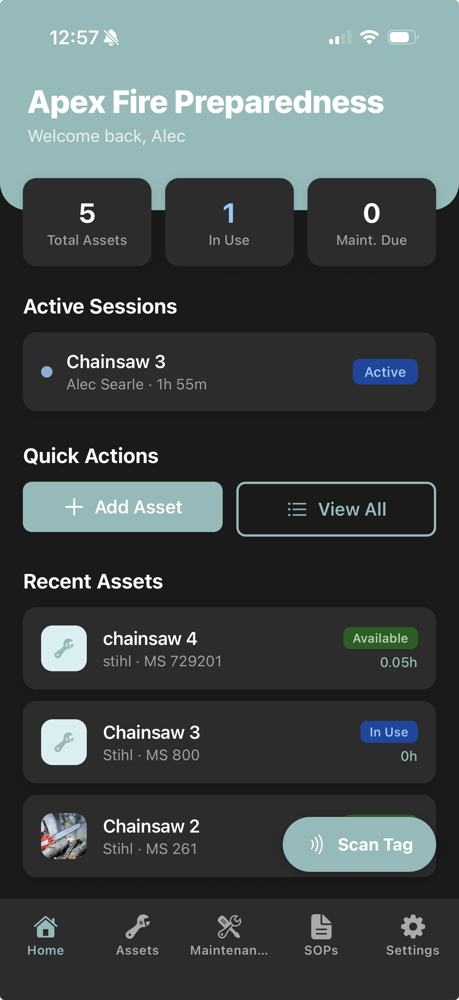

# Apex Tracking

A mobile app for small businesses to track equipment assets, usage sessions, maintenance schedules, and SOPs - built with React Native (Expo) and a Node.js/Express backend.

---

## Features

- **Asset management** — Track assets with name, brand, model, serial number, purchase date, NFC tag, photo, and PDF manual
- **Usage sessions** — Start/end sessions per asset; one active user at a time; pause/resume tracked client-side
- **Maintenance schedules** — Time-based or usage-hour-based recurring tasks with overdue/due-soon/on-track status
- **Maintenance reports** — File issues after a session; high/critical severity auto-flags the asset for maintenance
- **SOPs** — Business-wide or per-asset standard operating procedures stored as markdown
- **Multi-tenant** — Business isolation on every query; join via readable code (e.g. `APEX-7K2X`)
- **Role-based access** — Owner and Employee roles enforced on all mutation endpoints

---

## Tech Stack

### Frontend

|               |                                                       |
| ------------- | ----------------------------------------------------- |
| Framework     | React Native + Expo SDK 54                            |
| Language      | TypeScript (strict)                                   |
| Navigation    | Expo Router (file-based)                              |
| Auth          | `@supabase/supabase-js`                               |
| Styling       | Inline styles + `useColors()` theme hook (light/dark) |
| File handling | `expo-document-picker`, `expo-image-picker`           |
| HTTP          | Native `fetch` via typed `apiRequest<T>()` wrapper    |

### Backend

|              |                                      |
| ------------ | ------------------------------------ |
| Runtime      | Node.js 20+                          |
| Framework    | Express v5                           |
| Language     | TypeScript (strict)                  |
| Auth         | Supabase JWT verification middleware |
| ORM          | Prisma                               |
| Validation   | Zod (one schema per request shape)   |
| File uploads | Multer → Supabase Storage            |
| Logging      | pino                                 |
| Testing      | Jest + Supertest                     |

### Infrastructure

| Layer           | Provider                                      |
| --------------- | --------------------------------------------- |
| Database        | Supabase (PostgreSQL 15)                      |
| Auth            | Supabase Auth (email/password + Google OAuth) |
| File storage    | Supabase Storage (3 buckets)                  |
| Backend hosting | Render                                        |
| Mobile dev      | Expo Go                                       |
| Mobile builds   | EAS Build → TestFlight / Play Store           |

---

## Project Structure

```
apex-tracking/
├── frontend/               # React Native / Expo app
│   ├── app/
│   │   ├── (auth)/         # Login, signup, onboarding
│   │   └── (tabs)/         # Home, Assets, Maintenance, SOPs, Settings
│   ├── src/
│   │   ├── components/     # Reusable UI components
│   │   ├── contexts/       # AuthContext (session, businessId, role)
│   │   ├── hooks/          # Data-fetching hooks
│   │   ├── services/       # API service functions
│   │   ├── types/          # TypeScript interfaces
│   │   └── styles/         # globalColors.tsx (useColors hook)
│   └── lib/supabase.ts     # Supabase client
├── backend/
│   ├── src/
│   │   ├── config/         # Env validation, Supabase admin client
│   │   ├── middleware/      # Auth, role authorization, Zod validation, error handler
│   │   ├── routes/         # Express route definitions
│   │   ├── controllers/    # Request handlers
│   │   ├── services/       # Business logic
│   │   ├── repositories/   # Prisma queries (one file per model)
│   │   └── validators/     # Zod schemas
│   ├── prisma/
│   │   ├── schema.prisma
│   │   └── migrations/
│   └── tests/
│       ├── unit/
│       ├── integration/
│       └── security/
├── ARCHITECTURE.md         # Source of truth — read before writing code
└── PROGRESS.md             # What's built and what's next
```

---

## Local Setup

### Prerequisites

- Node.js 20+
- Expo CLI (`npm install -g expo-cli`)
- A Supabase project (free tier works)

### Steps

```bash
# 1. Clone
git clone https://github.com/alecsearle/apex-tracking.git
cd apex-tracking

# 2. Install dependencies
cd backend && npm install
cd ../frontend && npm install

# 3. Configure environment
cp backend/.env.example backend/.env
cp frontend/.env.example frontend/.env
# Fill in Supabase credentials in both files

# 4. Set up the database
cd backend
npx prisma migrate dev
npx prisma db seed

# 5. Start development (two terminals)
cd backend && npm run dev        # API on localhost:8080
cd frontend && npx expo start    # Expo dev server
```

### Root-level scripts (run both at once)

```bash
npm run dev           # Backend + frontend concurrently
npm test              # Backend test suite
npm run db:studio     # Prisma Studio (visual DB browser)
npm run db:reset      # Reset and re-seed the database
```

---

## Environment Variables

Variables are never hardcoded. Each workspace has a `.env.example` documenting all required keys.

**`frontend/.env`**

```
EXPO_PUBLIC_SUPABASE_URL=
EXPO_PUBLIC_SUPABASE_ANON_KEY=
EXPO_PUBLIC_API_BASE_URL=
```

**`backend/.env`**

```
PORT=
NODE_ENV=
SUPABASE_URL=
SUPABASE_SERVICE_ROLE_KEY=
DATABASE_URL=
SUPABASE_STORAGE_BUCKET_ASSETS=
SUPABASE_STORAGE_BUCKET_REPORTS=
SUPABASE_STORAGE_BUCKET_MAINTENANCE=
```

---

## API Overview

All routes are prefixed with `/api`. Business-scoped routes use `/api/businesses/:businessId/...`.

Key route groups:

- `POST /api/auth/sync` — Sync Supabase user into app database
- `/api/businesses` — Create/join a business, manage members
- `/api/businesses/:id/assets` — Asset CRUD, photo and manual uploads
- `/api/businesses/:id/assets/:id/sessions` — Usage session start/end
- `/api/businesses/:id/maintenance/schedules` — Schedule CRUD + due dashboard
- `/api/businesses/:id/reports` — Maintenance reports with photos
- `/api/businesses/:id/sops` — Standard Operating Procedures

See `ARCHITECTURE.md` for the full route table.

---

## Testing

```bash
cd backend
npm test                  # All tests
npm run test:coverage     # Coverage report
```

Test coverage includes: auth middleware, role-based access control, business isolation, session logic, maintenance due calculations, input validation, rate limiting, and file upload security.

---

## Security

- Supabase JWT verified on every request
- Rate limiting: 5/min on auth routes, 100/min general, 20/min uploads
- Zod validation on all request bodies, params, and query strings
- All DB queries scoped to authenticated user's `businessId`
- Helmet security headers + CORS
- File uploads: type-checked and size-limited (photos 10MB, PDFs 20MB)
- All secrets in environment variables — never in code

---

## Current Status

The backend is fully built and integrated. The frontend is wired to the real API. See `PROGRESS.md` for what's complete and what's remaining.


